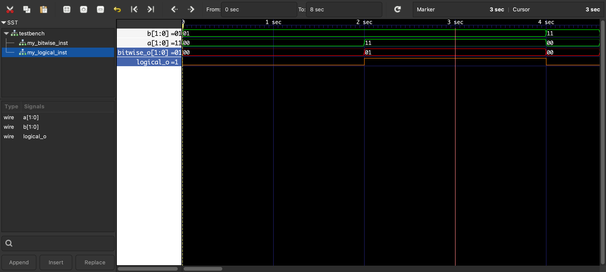

# hello-iverilog

This folder demonstrates a simple Icarus Verilog simulation setup with:
- `bitwise.v` (2-bit bitwise AND)
- `logical.v` (logical AND)
- `testbench.v` (top simulation module + stimulus)

## `testbench.v` Block Diagram (ASCII)

```text
                 +------------------------- testbench -------------------------+
                 |                                                            |
a[1:0] --------->|   +------------------ my_bitwise_inst -------------------+ |----> bt_out[1:0]
b[1:0] --------->|   |  bitwise_o = a & b                                   | |
                 |   +-------------------------------------------------------+ |
                 |                                                            |
a[1:0] --------->|   +------------------ my_logical_inst -------------------+ |----> lg_out
b[1:0] --------->|   |  logical_o = a && b                                  | |
                 |   +-------------------------------------------------------+ |
                 +------------------------------------------------------------+
```

## Behavior Summary

- `bt_out[1:0] = a & b` (bit-by-bit AND of the 2-bit vectors)
- `lg_out = a && b` (single boolean result: 1 only when both vectors are non-zero)
- `testbench.v` applies timed input patterns (`#2` delays) and dumps waveforms for viewing.


