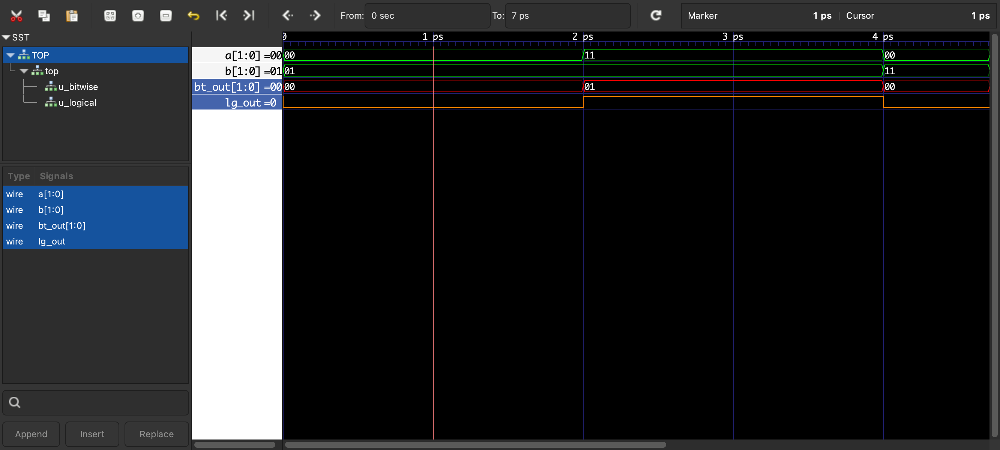

# hello-verilator

This folder demonstrates a small top-level module (`top.sv`) that instantiates
two child modules:
- `bitwise.sv` for 2-bit bitwise AND
- `logical.sv` for 1-bit logical AND

## `top.sv` Block Diagram (ASCII)

```text
                 +----------------------------- top -----------------------------+
                 |                                                              |
a[1:0] --------->|   +------------------ u_bitwise (bitwise.sv) -------------+ |----> bt_out[1:0]
b[1:0] --------->|   |  inputs : a[1:0], b[1:0]                              | |
                 |   |  output : bitwise_o[1:0] = a & b                       | |
                 |   +---------------------------------------------------------+ |
                 |                                                              |
a[0] ----------->|   +------------------ u_logical (logical.sv) -------------+ |----> lg_out
b[0] ----------->|   |  inputs : a[0], b[0]                                   | |
                 |   |  output : logical_o = a && b                           | |
                 |   +---------------------------------------------------------+ |
                 +--------------------------------------------------------------+
```

## Behavior Summary

- `bt_out[1:0] = a & b` (bitwise AND, both bits processed independently)
- `lg_out = a[0] && b[0]` (logical AND using only the LSB of each input bus)


